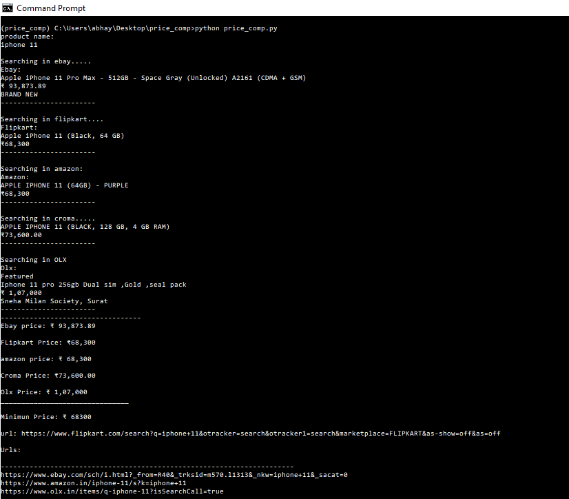

<br />
<p align="center">
  <a href="https://github.com/github_Abhayparashar/price-compare-app">
    
  </a>

  <h3 align="center">price-compare-app</h3>

  <p align="center">
    It takes the name of the product as input then it compares the price of the product from different websites(flipkart,amazon,ebay,olx,croma) then return the minimun price and the url of the product 
    <br />
    <a href="https://github.com/Abhayparashar31/price-compare-app/"><strong>Explore the Project »</strong></a>
    <br />
    <br />
    <a href="https://www.youtube.com/watch?v=Mtz2GrCJVRQ">View Demo</a>
    ·
    <a>Report Bug -> parasharabhay13@gmail.com</a>
    
  </p>
</p>


<!-- TABLE OF CONTENTS -->
## Table of Contents

* [About the Project](#about-the-project)
  * [Built With](#built-with)
* [Getting Started](#getting-started)
  * [Prerequisites](#prerequisites)
  * [Installation](#installation)
* [Contributers](#contributers)
* [License](#license)
* [Contact](#contact)


<!-- ABOUT THE PROJECT -->
## Project

 <a href="https://github.com/github_Abhayparashar/price-compare-app">
       
  </a>

`Abhayparashar31`, `price-compare-app`,  `parasharabhay13@gmail.com`


### Built With

* [Python](python)


<!-- GETTING STARTED -->
## Getting Started

Clone the repo and extract it ....

### Prerequisites

This is the list of things you need to use the software and how to install them.
* Python
```
Version python 3.8 <
```

### Installation
 
1. Clone the repo
```
git clone https://github.com/github_Abhayparashar31/price-compare-app.git
```
2. Install Python Libraries
```
pip install requests
pip install BeautifulSoup

```

3. Required Imports:
```
from bs4 import BeautifulSoup 
import requests
```
## Contributers

Abhayparashar31


<!-- LICENSE -->
## License

Distributed under the MIT License. See `LICENSE` for more information.


<!-- CONTACT -->
## Contact

Name - Abhay Parashar

Project Link: [https://github.com/Abhayparashar31/price-compare-app/](https://github.com/Abhayparashar31/price-compare-app/)


## References
* Stackoverflow
